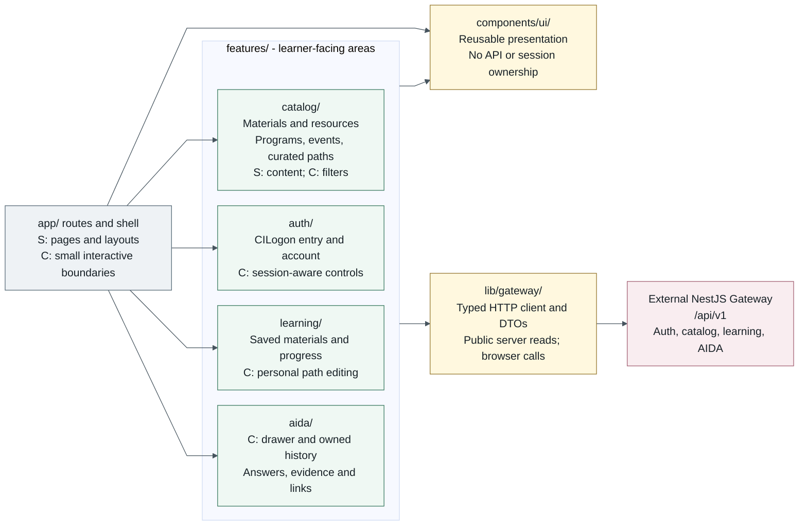

# HPC Learning Hub: Next.js Feature Architecture

**Status:** Proposed architecture, frozen author draft for independent review.
Documentation only; this is not a record of implemented features or a delivery
schedule. See the [author handoff](review/nextjs-author-handoff.md) for evidence.

Next.js has no Angular-style `NgModule`. Here, a **feature area** is a small group
of React components, hooks, and API helpers for one learner task. Routes compose
those pieces. There is no service/controller/module class for each database table.

## Dependency Overview

Arrows mean **imports/uses**, not redirects, response flow, or data ownership.
The arrows from the feature group apply to each feature as needed. Only the
Gateway arrow represents an external API dependency. S = Server Component;
C = Client Component. A feature can contain both, not one blanket client bundle.



[Open the rendered SVG](assets/nextjs-modules.svg). Read left to right: routes
choose features, features reuse UI and transport, transport calls the Gateway.
Shared UI and the client never import features or `app/`. The four features do
not import each other: compose save controls into material views and AIDA entry
points at the route/shell level using props or React slots. This keeps public
browsing independent of personal data and of AIDA availability.

## Proposed Folder Layout

Keep the existing root-level `app/` and `@/*` alias. Do not add `src/`, route
groups, or another routing system just to organize this small application.
`[E]` means present at the source revision; every unmarked entry is **proposed**.
The tree lists representative files, not files to create all at once. Square
brackets in route names represent dynamic IDs, not a feature status marker.

```text
hpc-learning-hub-frontend/
|-- app/
|   |-- layout.tsx                         [E] shared shell; compose AIDA entry
|   |-- page.tsx                           [E] / public starting points
|   |-- globals.css                        [E]
|   |-- loading.tsx                        route loading fallback
|   |-- error.tsx                          C: route render failure + retry
|   |-- not-found.tsx                      missing public record/page
|   |-- materials/
|   |   |-- page.tsx                       /materials; search and filters
|   |   `-- [materialId]/page.tsx          details + typed resource links
|   |-- programs/page.tsx                 programs/series and selected collection
|   |-- events/page.tsx                   upcoming/past list and selected event
|   |-- learning-paths/
|   |   |-- page.tsx                       curated paths
|   |   `-- [pathId]/page.tsx              ordered curated steps
|   |-- account/page.tsx                  CILogon entry + /me profile display
|   |-- my-learning/
|   |   |-- layout.tsx                     personal navigation, not an auth guard
|   |   |-- page.tsx                       saved materials, progress, personal paths
|   |   `-- conversations/page.tsx        AIDA history list/detail/delete
|   |-- maintainer/page.tsx               authorization smoke page only
|   `-- __tests__/sanity.test.tsx          [E] existing home heading test
|-- features/
|   |-- catalog/
|   |   |-- CatalogView.tsx                S: public results
|   |   |-- MaterialDetail.tsx             S: metadata/resources; action slots
|   |   |-- CatalogFilters.tsx             C: input and URL filter state
|   |   |-- ProgramsView.tsx               S: series/collection presentation
|   |   |-- EventsView.tsx                 S: dated events and linked materials
|   |   |-- CuratedPathView.tsx            S: ordered public steps
|   |   |-- api.ts                        typed catalog calls, no local search engine
|   |   |-- filters.ts                    UI-to-query mapping after OpenAPI agreement
|   |   `-- __tests__/filters.test.ts      filter mapping and missing values
|   |-- auth/
|   |   |-- AccountPanel.tsx               C: sign-in entry and account states
|   |   |-- SessionStatus.tsx              C: signed-in navigation presentation
|   |   |-- MaintainerSmoke.tsx            C: authorized/denied smoke result
|   |   |-- useSession.ts                 C: /me loading, expiry, sign-out refresh
|   |   |-- api.ts                        /me and agreed Gateway auth entry points
|   |   `-- __tests__/AccountPanel.test.tsx
|   |-- learning/
|   |   |-- MyLearning.tsx                C: saved/progress/path views
|   |   |-- SaveMaterialButton.tsx         C: pending/success/failure
|   |   |-- PersonalPathEditor.tsx         C: create, order, edit, delete
|   |   |-- useLearning.ts                C: request and mutation state
|   |   |-- api.ts                        /me/bookmarks, /me/progress, /me/learning-paths
|   |   `-- __tests__/MyLearning.test.tsx
|   `-- aida/
|       |-- AidaDrawer.tsx                C: launcher, question, answer and citations
|       |-- ConversationHistory.tsx       C: owned history and deletion
|       |-- useConversation.ts            C: pending, answer, error and expiry
|       |-- api.ts                        /aida requests through shared client
|       |-- types.ts                      UI state only, not duplicate response DTOs
|       `-- __tests__/AidaDrawer.test.tsx  answer modes, citations, keyboard focus
|-- components/ui/
|   |-- StatusMessage.tsx                 loading/empty/error/unauthorized presentation
|   |-- ResourceLink.tsx                  accessible canonical link presentation
|   `-- Dialog.tsx                        C: accessible dialog behavior
|-- lib/gateway/
|   |-- client.ts                         shared fetch/error/request-ID handling
|   |-- types.ts                          generated or contract-checked OpenAPI DTOs
|   `-- __tests__/client.test.ts           response/error fixtures and request scope
|-- types/                                [E] Next-generated route/cache declarations
|-- jest.config.cjs                       [E] retain current Jest/Testing Library setup
`-- docs/architecture/                    this documentation, not application code
```

`page.tsx` exposes a URL; `layout.tsx` composes shared presentation. `loading.tsx`
and `error.tsx` cover route transitions and render failures, not every in-flight
button or chat request. Add narrower boundaries only when a journey needs them.
An error in the root layout itself is not caught by `app/error.tsx`; a future
`global-error.tsx` would be a separate decision. These conventions were checked
against Next 16.3.3's bundled docs; see also the official
[project structure](https://nextjs.org/docs/app/getting-started/project-structure)
and [error boundary](https://nextjs.org/docs/app/api-reference/file-conventions/error)
references. In 16.3.3, the documented boundary recovery prop is `retry`.

Do not create a frontend `/api` directory, token callback route, Server Action
business API, or table-shaped services. `api.ts` files name feature operations;
`client.ts` owns HTTP mechanics. Existing `types/` files are generated framework
artifacts, not a home for Gateway entities. Keep API DTOs together under
`lib/gateway/`; introduce local feature types only for genuinely UI-only state.

## Responsibilities

| Area | Learner responsibility | Gateway dependency and limits |
| --- | --- | --- |
| Routes and shell | Public navigation, route composition, account navigation, consistent Ask AIDA entry. | Compose feature entry components/helpers; do not implement business endpoints or gate the public shell on `/me`. |
| Catalog | Search/filter, material details/resources, programs/series, events, curated paths. Covers FUS-01 to FUS-09 and FUS-13. | `/materials`, material detail/resources, `/topics`, `/tools`, `/systems`, `/event-series`, `/event-editions`, `/learning-paths` and path detail. Public reads. |
| Auth/account | Start CILogon sign-in/signup, show account/session state and maintainer smoke result. | `/me`; login/logout and smoke-check endpoint details still need OpenAPI. No password form, role editor, or account CRUD assumption. |
| Personal learning | Save/remove materials, show/update progress, create/edit/order/delete personal paths. FUS-14/15 and the prototype My Learning journey. | `/me/bookmarks`, `/me/progress`, `/me/learning-paths`; Gateway enforces user ownership. Increment after public catalog. |
| AIDA | Ask in material/resource context, render supported answers and links, revisit/delete owned conversations; feedback when contracted. FUS-10/11/12/16. | `/aida/conversations`, conversation detail/messages/delete, `/aida/messages`, message feedback. History belongs here even though its route is under My Learning. |
| Shared UI/client | Reusable accessible presentation; one transport and DTO vocabulary. | UI makes no API calls. Transport uses only Gateway `/api/v1`; no feature or database knowledge. |

Programs are a user-facing view of **event series**, not a new `/programs` API
or table. Events are dated editions and their materials. The proposed programs
and events pages can show selection within the page; this document does not
invent event-detail endpoints. Confirm series/edition relationships, selection,
pagination and query parameters in OpenAPI before integrating. Topic, tool,
system, instructor and resource-type discovery belong to catalog filters, not
separate feature modules. Recordings are material resources, not a second catalog.

Curated paths use Gateway catalog data, not an LLM path generator or a permanent
frontend hard-coded copy. Personal paths are separate user-owned records. Show
only resource types, links, dates and status actually supplied by the contract:
the persistence source does not promise material publication/freshness fields.
Do not turn a missing date into an upcoming event, or a missing resource into a
fabricated link. Interactive-video/player integration and timestamp resume are
not established by this folder layout.

## Server, Client and Authentication Boundaries

- Pages/layouts default to Server Components. Public catalog helpers may call
  Gateway from server-rendered views and pass serializable data into small
  interactive controls. Filters, saved actions, personal editors, session
  controls and the AIDA drawer/history need Client Components. Use `use client`
  at those boundaries, not at the root layout. A client boundary's imports enter
  its client graph; never import a server-only helper into it. This does not
  mean Client Components can only produce HTML in the browser. See the official
  [server/client guide](https://nextjs.org/docs/app/getting-started/server-and-client-components).
- The minimal proposal uses server reads for public data and browser-to-Gateway
  requests for session/personal interactions. The shared fetch core stays
  environment-neutral: explicit Gateway base URL and request options, no
  ambient cookie store or module-global current user. Public server requests
  send no user credentials. Browser session requests use the agreed cookie
  credentials policy. A future authenticated server read needs an explicit,
  server-only adapter and session-forwarding review, not a blanket copy of
  incoming headers. No such adapter is promised here.
- Rendering time, static versus request-time fetching, caching/revalidation,
  and hosting are **not decided**. Never put personal/session responses into a
  shared public cache. URL filter state is useful for back navigation and
  shareable discovery; exact parameter names are still a contract decision.
- Sign-in and signup use the same Gateway-owned CILogon flow. The browser
  navigates to the Gateway login entry and follows its identity-provider
  redirect; Gateway owns callback/code exchange, local learner creation,
  session issuance, logout and roles. New users become `LEARNER`. The frontend
  does not call CILogon token endpoints or handle access/refresh tokens.
- Use the Gateway's secure, HttpOnly, SameSite application session cookie.
  JavaScript does not read it or persist tokens/passwords in localStorage.
  `/me` supplies display identity/role, not frontend authorization authority.
  Gateway checks every personal request and the maintainer smoke operation.
  Hiding a link, a layout, or a browser role check is not an authorization gate.
- Deployment origin topology, cookie scope/SameSite value, CORS credentials,
  mutation CSRF protection, logout and allowed return URLs must be agreed with
  the Gateway owner before auth integration. This document does not invent
  endpoint names or claim that credentialed cross-origin fetch alone solves it.
  Handle expired sessions without leaving another user's private state visible.

Opening a validated public resource link in the learner's browser is intended
navigation. It is not permission for frontend code to query S3, PostgreSQL,
pgvector, NRP, or the ingestion worker. Catalog queries, auth/session/roles,
personal persistence, AIDA inference/retrieval/history all remain Gateway-owned.
No classifier loading, embeddings, ingestion, duplicate business API, Angular
modules, Docusaurus integration, state framework, or microfrontend is proposed.

## AIDA and Experience States

The shell keeps the catalog usable if AIDA is disabled or unavailable. AIDA
receives canonical `contextMaterialId` / `contextResourceId` when the learner
asks about a selected material/recording; IDs are opaque, not inferred from
titles or parsed for entity type. A route/shell-owned client composition can
pass the selected context into the drawer without coupling catalog to AIDA.

The four MVP strategies (`catalog_api`, `general_rag`, `transcript_rag`, `abstain`)
are internal Gateway implementations, not feature folders or learner modes.
The response can contain a `route` field; that is not the support level. Render
`answerMode` (`grounded`, `partial`, `general`, `abstained`), limitations and
canonical citations/links honestly. Material-only citations are valid when
resource/chunk IDs are null; abstentions can have no citations. Do not fabricate
transcript timestamps or present a retrieval failure as proof that no material
exists. Conversation summaries and suggested follow-ups are not evidence.

Authenticated history is Gateway-persisted and owner-scoped, with list, read
and delete UI. Guest AIDA enablement needs confirmation: the persistence notes
describe transient public AIDA, while system contract section 7.1 says it
**may** be supported. Neither supports durable guest history. Streaming versus
synchronous delivery and retention/deletion periods are unresolved; do not
promise streaming, browser-persisted guest history, or a retention duration.

Preserve loading, empty, error, unauthorized/forbidden, partial and abstained
states. Keep mutation/chat failures local to the control, retain honest retry
feedback and the Gateway request ID when safe, and distinguish no results from
unavailable service. Do not blindly replay a save or question POST after an
ambiguous failure; use the Gateway's agreed request/idempotency contract.
Accessibility belongs to every area: semantic navigation/headings and labels,
keyboard-operable filters, visible focus, dialog focus entry/return and escape,
announced status/results, readable errors, contrast and small-screen usability.
These are implementation/test duties, not claims that the prototype passed them.

## Existing Versus Proposed

At frontend `67cbb3f24cbe3ca1f671e647d86421356a93c7ff`, the app has a root layout,
an effectively empty home page, global CSS, a heading smoke test, TypeScript,
Jest/Testing Library, Tailwind/PostCSS, ESLint and CI configuration. There are
**no implemented catalog, auth, personal-learning or AIDA features**, no Gateway
client, and no additional application routes. The checked-in `types/` directory
contains generated Next declarations; it is not an implemented domain model.

Both package manifest and lockfile pin **Next 16.3.3 / React 19.2.8**. No installed
`node_modules/next` was present in the inspected shared checkout or new worktree.
The author inspected the exact npm `next@16.3.3` package's bundled docs in an
isolated tools directory instead of installing application dependencies. Online
Next docs already showed 16.3.4, so the exact package docs govern version claims.

## Incremental Adoption

1. Agree public DTOs and query parameters with Gateway; add the shared client
   and one material/resources route using canonical IDs. Preserve useful public
   loading, empty and error states before adding more journeys.
2. Grow catalog discovery, programs/events and curated paths from that contract.
   Translate the prototype's journeys, not its global scripts, local search
   ranking, fake data, password storage or maintainer submission form.
3. Confirm the cookie/origin/CSRF contract, then add account state and the
   maintainer smoke check. Add personal learning and owned history as their
   endpoints become available. Wire AIDA independently without making catalog
   availability depend on model availability.
4. Keep the existing testing stack for pure mappings, client transport and
   synchronous component interactions; add fixtures checked against OpenAPI.
   Existing Jest coverage globs and `knip.json` do not include `features/`, so
   update those configurations in the eventual implementation change, not this
   documentation change. Jest does not currently test async Server Components;
   agree an integration/browser test approach for those journeys before claiming
   coverage. No new test library is selected here.

## Source Revisions

Precedence: the user's narrowed scope and fixed Gateway contracts govern this
proposal. Prototype stories and UI provide journey evidence, not authority to
restore deferred features. Historical documents call the project SDSC Learning
Hub; this document uses the requested name **HPC Learning Hub**.

- **Frontend:** fetched remote default `master`, exact base
  [`67cbb3f24cbe3ca1f671e647d86421356a93c7ff`](https://github.com/sdsc-hpc-training-dev/hpc-learning-hub-frontend/tree/67cbb3f24cbe3ca1f671e647d86421356a93c7ff).
  Inspected `AGENTS.md`, `package.json`, lockfile, README, `app/`, `types/`, tests,
  and configuration. The shared local `master` was left at `9a59ec48d41d65f77117f9cfdb450fc3800bca28`.
- **Prototype current remote default:** `main`,
  [`deaf8e5371dd46fd525c0d668c49e3b50aa0aa46`](https://github.com/sdsc-hpc-training-dev/training-landing-page/tree/deaf8e5371dd46fd525c0d668c49e3b50aa0aa46).
  Includes `v1.0.0` and the merged auth prototype. This is newer design evidence,
  not proof of new product approval. Its account/QA notes still say `v0.0.6`.
- **Prototype working branch:** `codex/v0.0.6-auth-prototype`,
  [`4e318f39d2208bfc5dc99239d67445db70174e77`](https://github.com/sdsc-hpc-training-dev/training-landing-page/tree/4e318f39d2208bfc5dc99239d67445db70174e77),
  examined for `v0.0.6/PROTOTYPE_ACCOUNT_NOTES.md` and `v0.0.6/QA_NOTES.md`.
  Local `origin/main` was stale at `f6bfa6a`; current remote content was fetched
  only into a separate read-only source snapshot, not into the prototype checkout.
- **Gateway fixed baseline:**
  [`fda21d619dcc5119f1133501bafa8cc7e800c7cf`](https://github.com/sdsc-hpc-training-dev/hpc-learning-hub-apigateway/tree/fda21d619dcc5119f1133501bafa8cc7e800c7cf).
  No concurrent module-diagram work was used or modified.

| Evidence at the exact revisions above | Use in this architecture |
| --- | --- |
| [Functional stories](https://github.com/sdsc-hpc-training-dev/training-landing-page/blob/deaf8e5371dd46fd525c0d668c49e3b50aa0aa46/docs/functional-user-stories.md), [personas](https://github.com/sdsc-hpc-training-dev/training-landing-page/blob/deaf8e5371dd46fd525c0d668c49e3b50aa0aa46/docs/user-personas.md), [design decisions](https://github.com/sdsc-hpc-training-dev/training-landing-page/blob/deaf8e5371dd46fd525c0d668c49e3b50aa0aa46/docs/design-decisions.md) | Public discovery and optional continuity; submission and other old scope are excluded. |
| [Architecture/quality scenarios](https://github.com/sdsc-hpc-training-dev/training-landing-page/blob/deaf8e5371dd46fd525c0d668c49e3b50aa0aa46/docs/architectural-user-stories-and-quality-scenarios.md), [July 16 UX findings](https://github.com/sdsc-hpc-training-dev/training-landing-page/blob/deaf8e5371dd46fd525c0d668c49e3b50aa0aa46/docs/ux-testing/2026-07-16-first-time-user-landing-page/findings-and-action-items.md) | Clear navigation, canonical evidence, optional sign-in, accessibility and failure states; no unmeasured latency promise. |
| [July 28 review decisions](https://github.com/sdsc-hpc-training-dev/training-landing-page/blob/deaf8e5371dd46fd525c0d668c49e3b50aa0aa46/docs/meeting-notes/2026-07-28-mary-mai-portal-architecture-review/meeting-summary-and-decisions.md) | Curated first, catalog useful without AIDA. Historical Docusaurus/admin assumptions are superseded. |
| [v1.0.0 journey code](https://github.com/sdsc-hpc-training-dev/training-landing-page/tree/deaf8e5371dd46fd525c0d668c49e3b50aa0aa46/v1.0.0), [account notes](https://github.com/sdsc-hpc-training-dev/training-landing-page/blob/deaf8e5371dd46fd525c0d668c49e3b50aa0aa46/v1.0.0/PROTOTYPE_ACCOUNT_NOTES.md), [QA notes](https://github.com/sdsc-hpc-training-dev/training-landing-page/blob/deaf8e5371dd46fd525c0d668c49e3b50aa0aa46/v1.0.0/QA_NOTES.md) | `programs.js`, `material.js`, `learning-paths.js`, `saved.js` inform journeys, not production data/auth logic. |
| [System contracts](https://github.com/sdsc-hpc-training-dev/hpc-learning-hub-apigateway/blob/fda21d619dcc5119f1133501bafa8cc7e800c7cf/docs/system-contracts-v0.1.md), [persistence model](https://github.com/sdsc-hpc-training-dev/hpc-learning-hub-apigateway/blob/fda21d619dcc5119f1133501bafa8cc7e800c7cf/docs/sdsc-learning-hub-persistence-class-diagram.md) | API ownership, IDs, cookies, answer modes, user-owned records and canonical resources. OpenAPI remains the eventual HTTP schema authority. |
| [Implementation brief](https://github.com/sdsc-hpc-training-dev/hpc-learning-hub-apigateway/blob/fda21d619dcc5119f1133501bafa8cc7e800c7cf/docs/intern-implementation-brief.md), [ingestion spec](https://github.com/sdsc-hpc-training-dev/hpc-learning-hub-apigateway/blob/fda21d619dcc5119f1133501bafa8cc7e800c7cf/docs/specs/ingestion-worker.md), [router verdict](https://github.com/sdsc-hpc-training-dev/hpc-learning-hub-apigateway/blob/fda21d619dcc5119f1133501bafa8cc7e800c7cf/docs/aida-router-architecture-verdict.md) | Frontend-only presentation, staged personal features, no ingestion or router implementation in Next.js. |

## Decisions Still Open

Confirm with the Gateway/product owners before implementation: exact OpenAPI
schemas and filter/pagination names; event/series selection and relationship
DTOs; auth/logout/smoke endpoints and cookie/origin/CSRF/return-URL policy;
progress update/reset semantics (no precise video resume promise); guest AIDA
availability; answer delivery transport; retention/deletion policy; and
rendering/caching/hosting choices. The guest availability wording differs across
fixed sources and is deliberately left open. None of these choices is silently
implemented by a folder name or dependency arrow.
