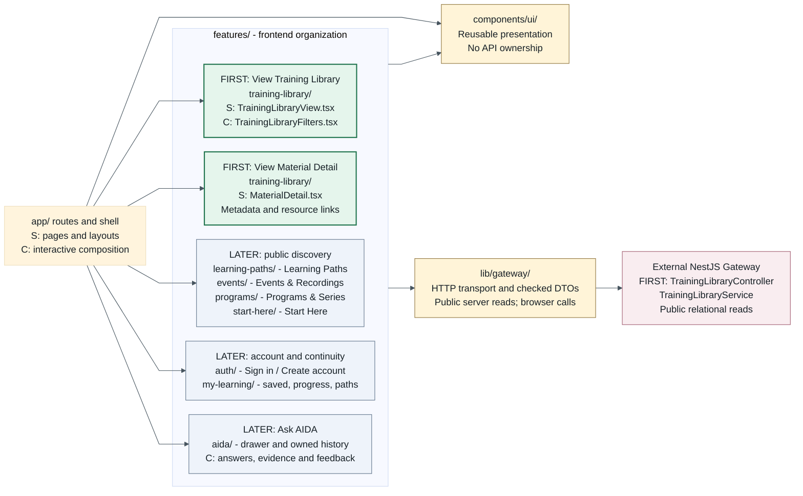

# HPC Learning Hub: Next.js Feature Architecture

**Shared design revision: `feature-boundaries-2026-09-04`.** Proposed structure,
not implemented features or approval of candidate contracts. The canonical
[shared feature mapping and naming decisions](https://github.com/sdsc-hpc-training-dev/hpc-learning-hub-apigateway/blob/main/docs/architecture/feature-module-mapping.md)
connects this document to the [NestJS MD](https://github.com/sdsc-hpc-training-dev/hpc-learning-hub-apigateway/blob/main/docs/architecture/nestjs-modules.md)
and [SVG](https://github.com/sdsc-hpc-training-dev/hpc-learning-hub-apigateway/blob/main/docs/architecture/assets/nestjs-modules.svg).

**Build View Training Library and View Material Detail first.** Both belong in
`features/training-library/`. Next.js has routes, React components, hooks and
transport helpers, not NestJS module/controller classes. Share feature vocabulary
with Gateway without forcing the same folder tree or one backend module per page.

## Feature Overview

Arrows mean **imports/uses**; only the final arrow is external HTTP. Arrows from
the feature group apply to each feature as needed, not a dependency on every
other feature. S = Server Component; C = Client Component. LATER means increments
after the two initial views, not removal of other MVP capabilities.



[Open the zoomable SVG](assets/nextjs-modules.svg). The two FIRST boxes are
views in **one feature folder**, not two frontend modules. LATER boxes group
small folders for readability; they are not new umbrella folders. Use this
table/folder layout on narrow screens rather than a fit-to-width thumbnail.

## First Two Feature Paths

Route folders below are **proposed portal URLs**, not new API endpoints. The
existing baseline/candidate operation inventory uses Gateway `/api/v1` with
`GET /materials`, `GET /materials/{materialId}` and
`GET /materials/{materialId}/resources`. These are target operations, not
implemented routes or complete DTOs. Resolve query names, pagination, missing
records and resource serialization under
[HTTP-01/02 and D-02/D-11](https://github.com/sdsc-hpc-training-dev/hpc-learning-hub-apigateway/blob/main/docs/contracts/system-contracts-v0.2-candidate.md#HTTP-01)
before integration; do not infer wire contracts from prototype JavaScript.

| Screen                       | Proposed Next.js path                                                                                                                                  | Gateway path                                                                           | Existing persistence responsibility                                                                                                                                            |
| ---------------------------- | ------------------------------------------------------------------------------------------------------------------------------------------------------ | -------------------------------------------------------------------------------------- | ------------------------------------------------------------------------------------------------------------------------------------------------------------------------------ |
| **1. View Training Library** | `app/materials/page.tsx` -> `features/training-library/TrainingLibraryView.tsx` + `TrainingLibraryFilters.tsx` -> feature `api.ts` -> shared transport | `TrainingLibraryController` -> `TrainingLibraryService` -> `TrainingLibraryRepository` | Read active-snapshot `TrainingMaterial`, vocabularies/aliases and explicit material joins for results/filters/counts. Worker writes imported records; Gateway owns migrations. |
| **2. View Material Detail**  | `app/materials/[materialId]/page.tsx` -> `features/training-library/MaterialDetail.tsx` -> same API helper/transport                                   | Same controller/service/repository, canonical material and resource lookup             | Read `TrainingMaterial`, `MaterialResource`, `ContentResource`, `ContentResourceFile` and related metadata joins. Same ownership, no new tables.                               |

Both are public and remain usable **without login, AIDA, vector retrieval or S3
reads at request time**. Preserve opaque material/resource IDs, filter context
on return, useful loading/empty/error/not-found states and accessible canonical
links. Do not invent publication dates, resource links, transcript timestamps,
related-material endpoints or player/resume behavior from the prototype.

## Proposed Folders

Keep the existing root `app/` and `@/*` alias. `[E]` means existing; every other
entry is proposed. Create only the first increment's files initially.

```text
app/
  layout.tsx                            # [E] S: shell and navigation
  page.tsx                              # [E] later composes StartHereView
  globals.css                           # [E]
  loading.tsx                           # route transition state
  error.tsx                             # C: route render failure
  not-found.tsx                         # missing record/page
  materials/
    page.tsx                            # FIRST: Training Library
    [materialId]/page.tsx                # FIRST: Material Detail
  learning-paths/
    page.tsx                            # LATER: public curated paths
    [pathId]/page.tsx                    # ordered curated steps
  events/page.tsx                       # Events & Recordings
  programs/page.tsx                     # Programs & Series
  account/page.tsx                      # sign-in/signup and account state
  my-learning/
    page.tsx                            # saved, progress, personal paths
    conversations/page.tsx              # composes AIDA-owned history UI
  maintainer/page.tsx                   # role smoke page only
features/
  training-library/
    TrainingLibraryView.tsx              # S: material results
    TrainingLibraryFilters.tsx           # C: input and URL filter state
    MaterialDetail.tsx                   # S: metadata/resources, action slots
    api.ts                              # public material/filter operations
    filters.ts                          # UI mapping after DTO agreement
    __tests__/filters.test.ts
  learning-paths/
    LearningPathsView.tsx                # S: list and ordered curated steps
    api.ts                              # public path operations
  events/
    EventsView.tsx                       # S: editions and linked recordings
    api.ts                              # Gateway Training Library queries
  programs/
    ProgramsView.tsx                     # S: series and selected collection
    api.ts                              # Gateway Training Library queries
  start-here/
    StartHereView.tsx                    # S: intro/navigation, content slots
  auth/
    AccountPanel.tsx                     # C: sign-in and account states
    SessionStatus.tsx                    # C: navigation presentation
    MaintainerSmoke.tsx                  # C: authorized/denied result
    useSession.ts                       # C: /me lifecycle, expiry, sign-out
    api.ts                              # agreed Gateway auth operations
  my-learning/
    MyLearningView.tsx                   # C: saved materials and progress
    SaveMaterialButton.tsx               # C: local mutation states
    PersonalPathEditor.tsx               # C: create/order/edit/delete
    useMyLearning.ts                     # C: request/mutation state
    api.ts                              # owner-scoped Gateway operations
  aida/
    AidaDrawer.tsx                       # C: question, answer, citations
    ConversationHistory.tsx              # C: owned list/read/delete
    useConversation.ts                   # C: request and feedback states
    api.ts                              # Gateway AIDA operations
components/ui/
  MaterialCard.tsx                       # receives display data/link props
  ResourceLink.tsx                       # accessible link presentation
  StatusMessage.tsx                      # loading/empty/error presentation
  Dialog.tsx                            # C: accessible dialog behavior
lib/gateway/
  client.ts                             # shared fetch/error/request-ID handling
  types.ts                              # generated or contract-checked DTOs
  __tests__/client.test.ts
types/                                  # [E] Next-generated declarations
```

`page.tsx` exposes a URL; `layout.tsx` composes shared presentation. Feature
folders hold views/hooks and named API helpers; `components/ui/` owns reusable
presentation without requests. `lib/gateway/` owns HTTP mechanics, not search,
authorization or business rules. Existing `types/` is not the domain DTO home.
Do not introduce Next.js `/api` business endpoints, token callbacks or an ORM.

Routes/shell compose features through props/slots, without feature-to-feature
imports. For Start Here, `app/page.tsx` supplies Library/Path content to
`StartHereView`; no new API is needed. The material route may later compose a
My Learning save control or AIDA entry without coupling public content to them.

## Later Features And Backend Reuse

| Learner feature          | Backend dependency and limit                                                                                                                                                                           |
| ------------------------ | ------------------------------------------------------------------------------------------------------------------------------------------------------------------------------------------------------ |
| Learning Paths           | `LearningPathsController` / `LearningPathsService`; ordered public curated records, separate from personal paths. Source/IDs/population remain D-12, not hard-coded curriculum or LLM path generation. |
| Events & Recordings      | `TrainingLibraryController` / `TrainingLibraryService`: `EventEdition`, event/material joins and recording resources. No implied event-detail endpoint or separate recordings catalog.                 |
| Programs & Series        | Same Training Library boundary: `EventSeries` and series/edition joins. No new `/programs` API/table.                                                                                                  |
| Start Here               | Compose Training Library and Learning Paths selections. No StartHereModule or new persistence.                                                                                                         |
| Sign in / Create account | `AuthController` / `AuthService` -> `UsersService`; one Gateway CILogon flow, not a password form or role editor. Maintainer surface is a smoke page only.                                             |
| My Learning              | `MyLearningController` / `MyLearningService`: owned bookmarks, progress and personal path CRUD/order. Gateway enforces ownership. No path-visibility feature or precise video resume promise.          |
| Ask AIDA / history       | `AidaController` / `AidaService`: context-aware questions, canonical citations, owned history/read/delete and contracted feedback. History stays in `aida/` even under a My Learning URL.              |

Training Library/Detail cover FUS-03/04/05/06/07/13; Start Here/curated paths
cover FUS-01/02; Events cover FUS-08/09; AIDA covers FUS-10/11/12/16;
My Learning covers FUS-14/15 and personal paths. Historical submissions,
moderation and unsupported freshness features are not restored by this mapping.

## Server, Client And Session Boundaries

- Pages/layouts default to Server Components. Use small `use client` boundaries
  for filters, session controls, mutations and AIDA. Do not import server-only
  helpers into client graphs. Route loading/error boundaries do not replace
  local mutation/chat states, and `app/error.tsx` does not catch root-layout errors.
- Proposed starting point: public server reads without user credentials;
  session/personal interactions call Gateway from the browser. The shared fetch
  core accepts explicit base URL/options, with no ambient cookies or global
  current user. Rendering time, caching/revalidation and hosting are undecided.
  Never put private responses in shared public caches.
- Gateway owns CILogon code exchange, local account/role rules and secure
  HttpOnly session cookies. No browser tokens/password storage, provider secrets
  or CILogon token calls. `/me` controls presentation, not authorization. The
  Gateway guards every private operation; a hidden link is not access control.
- D-04 still gates origin/cookie/SameSite/CORS/CSRF/logout/allowed-return policy.
  Shell composition passes identity changes to My Learning and AIDA. On expiry,
  sign-out or account switch, clear private state and ignore old-session results.
  Do not gate public navigation or Library/Detail availability on `/me`.
- Preserve local pending/success/failure, unauthorized/forbidden and honest
  retry states. Do not blindly replay ambiguous mutations/question POSTs;
  D-02 governs idempotency. Use semantic navigation, labeled keyboard controls,
  visible focus, announced results, accessible dialog focus and small-screen layouts.

Opening a canonical resource is navigation, not permission for the frontend
to query S3, PostgreSQL, pgvector, NRP or the Python worker. Shared services
and all migrations remain in Gateway; ingestion remains a separate Python job.

## AIDA Presentation And Open Decisions

Keep Ask AIDA optional to public browsing. Pass canonical material/resource
context through route/shell composition; do not infer IDs from titles or prefixes.
`catalog_api`, `general_rag`, `transcript_rag`, `abstain` are internal Gateway
strategies, not frontend modules. Render `answerMode` (`grounded`, `partial`,
`general`, `abstained`) separately from `route`, with honest limitations and
canonical citations. Material-only citations may have null resource/chunk IDs;
abstentions may have no citations. Never invent timestamp links or evidence.

Guest one-turn AIDA is D-03, not promised guest history. Streaming/turn completion
is D-07; owned-history deletion/retention is D-06; context and video-to-transcript
association are D-10. Classifier promotion (D-08), embeddings (D-09) and chunk
uniqueness (D-05) stay backend/worker gates, not frontend implementation choices.
No GraphRAG/Neo4j, submission/draft/moderation or path-visibility workflow.

Read the [candidate entrypoint](https://github.com/sdsc-hpc-training-dev/hpc-learning-hub-apigateway/blob/main/docs/contracts/agent-entrypoint.md)
and [decision register](https://github.com/sdsc-hpc-training-dev/hpc-learning-hub-apigateway/blob/main/docs/contracts/decisions-needed.md).
Published v0.2 remains CANDIDATE, not an approved replacement for v0.1. Library
and Detail can proceed with source-grounded components/fixtures, but integration
waits on their operation's reviewed DTOs, resource policy and catalog mappings.

## Evidence, Rendering And Checks

Frontend `master` was fetched at `30c9dbced5adc48248fcef6ae1d4a681015fa2d5`:
root `app/`, empty home heading, layout/CSS and starter tests, no feature folders
or Gateway client. Manifest pins Next 16.3.3 / React 19.2.8. The retained exact
Next package's bundled project-structure guide was consulted; no app installation
or code/config changes are needed for this documentation revision.

The [shared mapping](https://github.com/sdsc-hpc-training-dev/hpc-learning-hub-apigateway/blob/main/docs/architecture/feature-module-mapping.md)
pins the unchanged design v1.0.0 remote, Gateway sources and September 4 screen
evidence. Prototype navigation is evidence of vocabulary, not v3 DTO/schema
authority. Yesterday's [author handoff](review/nextjs-author-handoff.md),
[independent review](review/nextjs-independent-review.md) and
[dispositions](review/nextjs-final-dispositions.md) apply to the **prior revision**;
they remain historical, unchanged. One bounded cross-diagram self-review checked
the shared mapping, initial paths and ownership; label wrapping and backend group
headings were corrected for readability. No new independent review was performed.

Render the single Mermaid fence with the cached Mermaid CLI 11.17.0 / Mermaid
11.17.2 / Puppeteer 24.43.1 and Chrome/Arial documented in that handoff. Extract
to a temporary `.mmd`, then use `mmdc -i source.mmd -o output.svg -p puppeteer.json
-w 1600 -H 1000 -b white -I hpc-nextjs-modules` (Gateway uses
`-I hpc-nestjs-modules`). Keep extraction/QA tools outside the repos; do not
hand-edit generated SVGs. Check rendering, label containment, arrows, links,
folder/matrix consistency, formatting and docs-only diff before publication.

Eventual implementation tests should cover public Library -> Detail -> return,
empty/error/unavailable resources, filter mapping and later session transitions.
Use existing Jest/Testing Library where appropriate; current coverage/Knip globs
need adjustment when `features/` is implemented, not in this docs change. Async
Server Component/browser coverage needs an agreed integration test approach.
